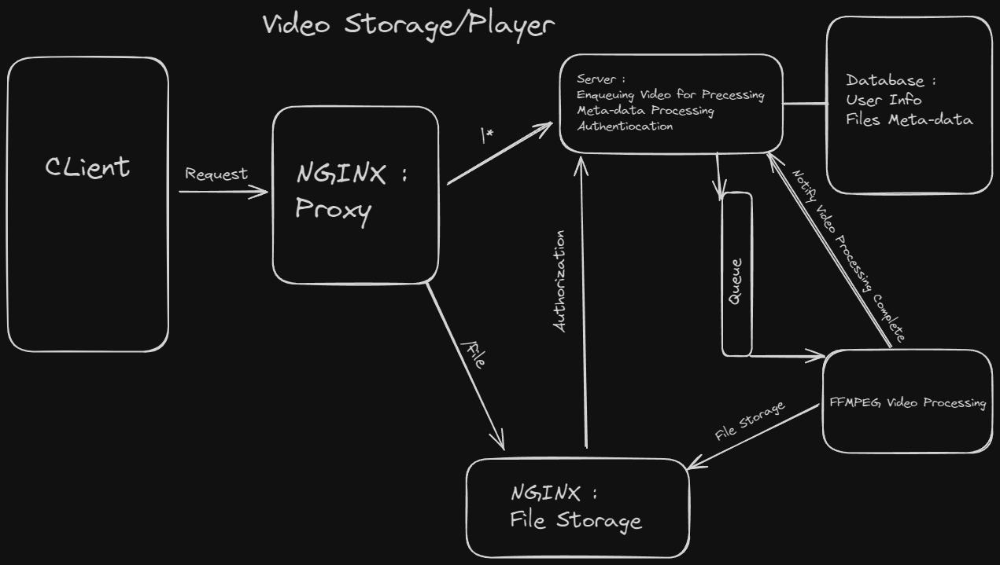

# Audio Files Storage
Simple project made for learning purpose.
The project should allow users to connect to the service, each user could upload audio files, listen to them and organize them using playlists/groups.

This project is made using Python 3.11+

This is a quick schema of the design I made for this application really quickly (Remember this is for learning purpose, and it's overcomplicated for personal use, so I can combine multiple technilogies I'm interested in)

